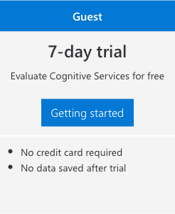
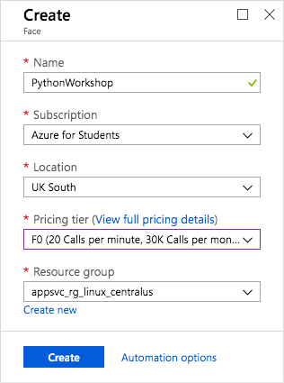

# Analyse the photo using AI

In the [previous step](./AddWebApi.md) you added a route to this app to provide a Web Api to accept a photo that can be sent by the app, and extracted the image from the JSON. In this step you will analyze the image for faces using AI, checking each face for emotion and if the person is smiling.

## Using AI to analyze images

AI, or Artificial Intelligence is where computers can perform tasks normally associated with people, not computers. Computers can learn how to do something, rather than be told how to do it using explicit instructions by writing programs. For example, a computer can be trained how to recognize cats by being shown thousands of images of cats. You can then give it an image it hasn't seen before, and it can tell if there is a cat in the image. This is called Machine Learning or ML. Once taught, the computer builds a model, and this can be re-used by other computes to perform the same task.

You can train Machine Learning models yourself, or you can use models created by others. Microsoft has a range of these pre-trained models available, called [Cognitive Services](https://azure.microsoft.com/services/cognitive-services/?WT.mc_id=pythonworkshop-github-jabenn). These models include recognizing images, recognizing speech, or translating between different languages.

One of the models, the [Face Api](https://azure.microsoft.com/services/cognitive-services/face/?WT.mc_id=pythonworkshop-github-jabenn), can be used to look for faces in an image. If it finds any, it can guess the emotion shown on the face (happiness, sadness etc.), tell if the person is smiling, look for hair color, facial hair, even estimate the persons age. We can use this Api in our app to look for faces in the uploaded image, predict the age and the emotion.

## Sign up for a Face Api subscription key

Before you can use the Face Api, you will need a subscription key. You can do this using a free trial key that lasts 7 days, or from your Azure account.

### Use a free trial key

* Open [azure.microsoft.com/services/cognitive-services/face/](https://azure.microsoft.com/services/cognitive-services/face/?WT.mc_id=pythonworkshop-github-jabenn) in your browser.

* Select the green **Try Face** button

* Select **Getting Started** from the *Guest* section.

  

* Agree to the terms and conditions (assuming you do agree), and select your country

* Sign in with an account, such as a Microsoft, GitHub or Facebook account.

* You will then see information on your 7 day trial, including an `Endpoint` and 2 keys. Keep a note of the *Endpoint* and one of the keys as you will need these values later.

  

### Use an existing Azure Subscription

* Open the Azure Portal from [portal.azure.com](https://portal.azure.com/?WT.mc_id=pythonworkshop-github-jabenn).

* Select *Create a resource* or select the green plus button.

* Search for *Face*
  
  

* Select *Face*, then select the **Create** button.

* Enter the required details:
  * Give this a name. This only needs to be unique to you.
  * Select the Azure Subscription you want to use.
  * Choose a location to run this code. Azure has 'regions' all around the world, a region being a group of data centers full of computers and other cloud hardware. Choose a region closest to you.
  * Select the pricing tier. With this app, you will make less than 20 calls a minute, and less than 30,000 calls a month then select *F0*, the free tier. There is a paid tier for apps that need to use the service more often.
  * Select the resource group you want to run the code in. One would have been created for you when you deployed the web app in an earlier step called something like `appsvc_rg_linux_centralus`, so select this one.
  * Select the **Create** button.

    > Everything you create in Azure, such as access to the Face Api, App Services, and databases are called Resources. Resource groups are a way to group resources together so you can manage them in bulk. By having everything for this workshop in the same resource group makes it easy to delete everything at the end when you have finished.

  

* The face resource will be created. You will be notified when done. Select **Go to resource** from the popup, or the notification pane.
  
  

* From the resource, head to the *Overview* tab. Take a note of the *Endpoint* as you will need this later.

* Head to the *Keys* tab. Keep a note of one of the keys as you will need this later.

## Install the Face Api package

The Face Api is available as a Python package.

* Open the `requirements.txt` file in Visual Studio Code.

* Add the following to the bottom of the file:

  ```python
  azure-cognitiveservices-vision-face
  ```

* Save the file

* Install the new package from the terminal using the following command:
  
  ```sh
  pip install -r requirements.txt
  ```

## Write the code

* Open the `app.py` file in Visual Studio Code.

* Add imports for the Face Api package and an authentication package, as well as some system libraries to the top of the file, below the other imports.
  
  ```python
  from azure.cognitiveservices.vision.face import FaceClient
  from msrest.authentication import CognitiveServicesCredentials
  import io
  import uuid
  ``

* Create two variables for the Face Api endpoint and key that you noted down earlier. Add this code just above the `upload_image` function, above the route declaration.

  ```python
  face_api_endpoint = 'https://centralus.api.cognitive.microsoft.com'
  face_api_key = '<key>'
  ```
  
  Replace the `face_api_endpoint` with the first part of the endpoint you noted down earlier. You don't need the `/face/v1.0` part.

  Replace the value of `face_api_key` with one of your keys. It doesn't matter which one.

* Add the following code below this:

  ```python
  credentials = CognitiveServicesCredentials(face_api_key)
  face_client = FaceClient(face_api_endpoint, credentials=credentials)

  def best_emotion(emotion):
    emotions = {}
    emotions['anger'] = emotion.anger
    emotions['contempt'] = emotion.contempt
    emotions['disgust'] = emotion.disgust
    emotions['fear'] = emotion.fear
    emotions['happiness'] = emotion.happiness
    emotions['neutral'] = emotion.neutral
    emotions['sadness'] = emotion.sadness
    emotions['surprise'] = emotion.surprise
    return max(zip(emotions.values(), emotions.keys()))[1]
  ```

* In the `upload_image` function, add the following code to the bottom, but **before** the `return 'OK` statement:

    ```python
    image = io.BytesIO(b)
    faces = face_client.face.detect_with_stream(image,
                                                return_face_attributes=['age', 'smile', 'emotion'])

    for face in faces:
        doc = {
                'id' : str(uuid.uuid4()),
                'age': face.face_attributes.age,
                'smile': 'Yes' if face.face_attributes.smile > 0.5 else 'No',
                'emotion': best_emotion(face.face_attributes.emotion)
              }
    ```

## What does this code do

The overall flow of this code is:

1. Create a FaceClient using the endpoint and key from the Face Api resource in Azure
1. Convert the binary image data to a stream of data that the face client can process
1. Detect faces in the image stream
1. Loop though all the faces creating an object that contains a unique id, the detected age of that face, if that face is smiling and the detected emotion

Lets look in more detail at the actual code.

```python
from azure.cognitiveservices.vision.face import FaceClient
from msrest.authentication import CognitiveServicesCredentials
import io
```

This tells the Python compiler that we want to use code in the `FaceClient` module from the `azure-cognitiveservices-vision-face` package, as well as the `CognitiveServicesCredentials` from the `msrest-authentication` package. The `msrest-authentication` package was not installed directly, but is a dependency of the `azure-cognitiveservices-vision-face` package, so it gets installed automatically. It also tells the python compiler that we want to use `io` from the Python standard libraries

```python
face_api_endpoint = 'https://centralus.api.cognitive.microsoft.com'
face_api_key = '<key>'
```

This code declares variables to store the Face Api Endpoint and key.

```python
credentials = CognitiveServicesCredentials(face_api_key)
```

To use the Face Api, you need to tell it which account to use, and prove that you are allowed to access this resource. This is controlled by the key which only you, or other people you are working with, should know. This code creates a `CognitiveServicesCredentials` instance containing this key.

```python
face_client = FaceClient(face_api_endpoint, credentials=credentials)
```

This code creates a `FaceClient` using the credentials you just created, along with the Endpoint pointing to your Face Api resource. This Endpoint needs to be defined to tell the face client where in the world your resource has been created.

```python
def best_emotion(emotion):
```

This code defines a function that takes the emotions from the face detection.

```python
emotions = {}
emotions['anger'] = emotion.anger
emotions['contempt'] = emotion.contempt
emotions['disgust'] = emotion.disgust
emotions['fear'] = emotion.fear
emotions['happiness'] = emotion.happiness
emotions['neutral'] = emotion.neutral
emotions['sadness'] = emotion.sadness
emotions['surprise'] = emotion.surprise
```

The emotion information is sent as a set of properties on the emotion with a value for how likely it is that that particular emotion is being shown on a scale of 0-1, 0 being not likely and 1 being very likely. We want to store the emotion with the highest likelihood, so this code puts these values into a dictionary of the name of the emotion to the likelihood.

```python
return max(zip(emotions.values(), emotions.keys()))[1]
```

This code looks through the dictionary of emotions and detects the one with the highest likelihood, returning its name as the return value of the `best_emotion` function.

```python
image = io.BytesIO(b)
```

The face client cannot process raw binary data directly, so it needs a stream of data. This is a wrapper around the binary data containing the image and makes it easier for the face client to read.

```python
faces = face_client.face.detect_with_stream(image,
                                            return_face_attributes=['age', 'smile', 'emotion'])
```

This code passes the image steam to the face client to detect faces. By default this `detect_with_stream` method just detects faces, returning a list of faces found with little additional information. You can request more information using the `return_face_attributes` parameter, passing in the facial information you want. In this case, the code is requesting the age, if the face is smiling and the emotion.

```python
for face in faces:
```

The return value from the face detection is a list of faces, so this loops through the list.

```python
doc = {
        ...
      }
```

This code creates an object to store the facial information. This will eventually be stored in a database.

```python
'id' : str(uuid.uuid4()),
```

This code adds an `id` value to the document. This needs to be unique as it is an identifier for the object in the database.

```python
'age': face.face_attributes.age,
```

The `age` on the document is set to the detected age for the face.

```python
'smile': 'Yes' if face.face_attributes.smile > 0.5 else 'No',
```

This code checks if the face is detected as smiling, and if so sets the `smile` on the document to be `Yes`, otherwise it sets it to be `No`.

```python
'emotion': best_emotion(face.face_attributes.emotion)
```

The `emotion` value on the document is set to the most likely emotion using the `best_emotion` function.

## Next step

In this step you analyzed the image for faces using AI, checking each face for emotion and if the person is smiling. In the [next step](./SaveTheResultsToADatabase.md) you will save the results of the analysis into a database.
